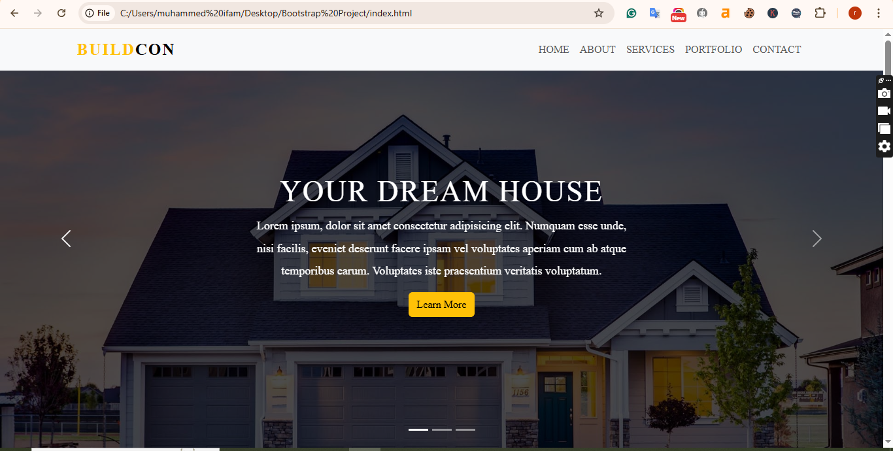

# BuildCon – Bootstrap Project  

This is a simple construction company website built with **Bootstrap 5**.  
It includes sections like navbar, carousel, about, services, portfolio, team, and contact.  

## 🚀 Features
- Responsive design using Bootstrap 5
- Carousel slider
- About and Services sections
- Portfolio grid
- Team profiles
- Contact form
- Footer

## 🛠️ Technologies Used
- HTML5
- CSS3
- Bootstrap 5
- Bootstrap Icons

## 📂 Project Structure
bootstrap-project/
│── index.html
│── asset/
│ ├── style.css
│ ├── home-1.jpg
│ ├── home-2.jpg
│ ├── home-3.jpg
│ ├── about.jpg
│ ├── project-1.jpg
│ ├── project-2.jpg
│ ├── project-3.jpg
│ ├── team-1.jpg
│ ├── team-2.jpg
│ ├── team-3.jpg
│ ├── team-4.jpg

## 📸 Project Preview

